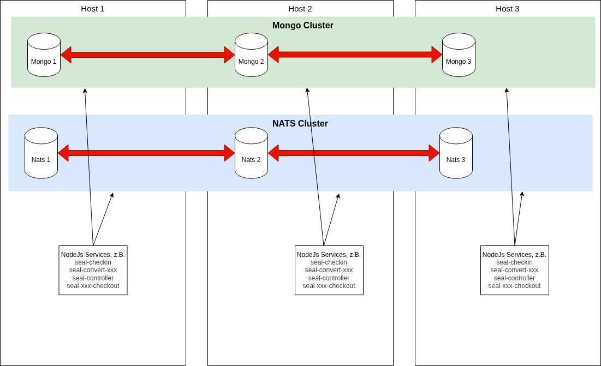

# Architecture



## Mongo Config

### Cache einschränken

```yaml
storage:
  wiredTiger:
    engineConfig:
        cacheSizeGB: 2
```

### TLS CA Zertifikate

Wenn ein CA Zertifikat konfiguriert werden muss.

```yaml
net:
  tls:
    CAFile: xxx.pem
```

Dann muss das System Zertifikate entfernt werden.

```yaml
setParameter:
#  tlsUseSystemCA: true
```

## Mongo Probleme

### Platte voll

Lösungsschritte:

- SEAL Software inkl. MongoDB auf allen Rechnern im Cluster runterfahren

- Platte vergrößern lassen

- Zuerst die MongoDB Services wieder hochfahren und warten bis "rs.status()" anzeigt, dass alle Server synchronisiert sind

- Danach erst SEAL Software hochfahren

### Eine MongoDB im Cluster funktioniert nicht mehr

Nach längerem ausfall eines MongoDB Service kann es passieren, dass er sich nach dem Hochfahren nicht mehr synchronisieren kann. Hier hilft nur eine vollständige Neusynchronisierung.

Lösungsschritte:

- SEAL Software auf allen Rechnern im Cluster runterfahren

- Betroffenen MongoDB Service herunterfahren

- Alle Dateien im MongoDB Datenverzeichnis (Linux: /opt/seal/data/seal-mongodb, Windows: c:\ProgrammData\SEAL Systems\data\seal-mongo) löschen. **Achtung:** nicht das Verzeichnis selbst löschen.


### ReplicaSet nicht initialisiert

Wenn ein "rs.status()" die Meldung "MongoServerError: no replset config has been received" liefert, wurde "rs.initiate()" vergessen.


## Mongo Kommandos

### MongoDB Shell Aufruf

Windows:
```powershell
& "C:\Program Files\mongosh\mongosh.exe" --tls --tlsAllowInvalidCertificates
```
Linux:
```bash
mongosh --tls --tlsAllowInvalidCertificates
```

### Batch Kommandos generell

```
mongosh --eval „<Kommando>“
```

### ReplicaSet prüfen

```
rs.status()
```

Vollständige Zeile: 

```bash
mongosh --tls --tlsAllowInvalidCertificates --eval "rs.status()"
```


## NATS Probleme

KEINE!

Aber: ein seal-co-notifier Problem den NATS KV Store korrekt zu benutzen. Ist mit seal-co-notifier 5.12.
